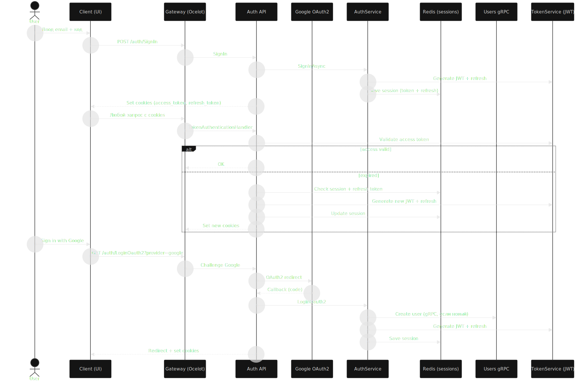
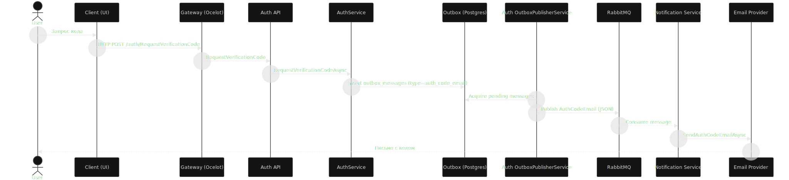
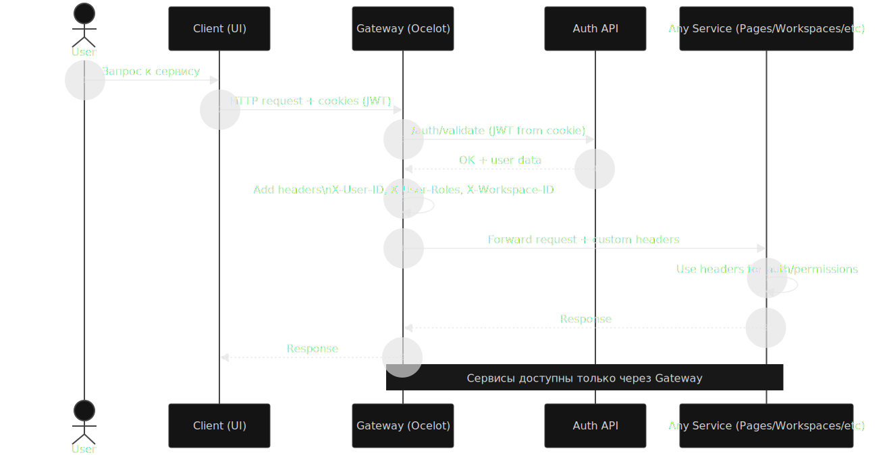
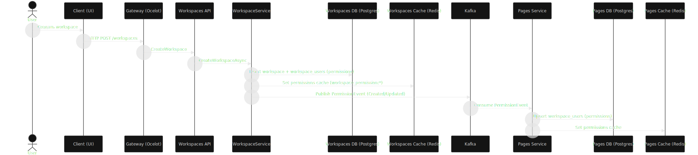
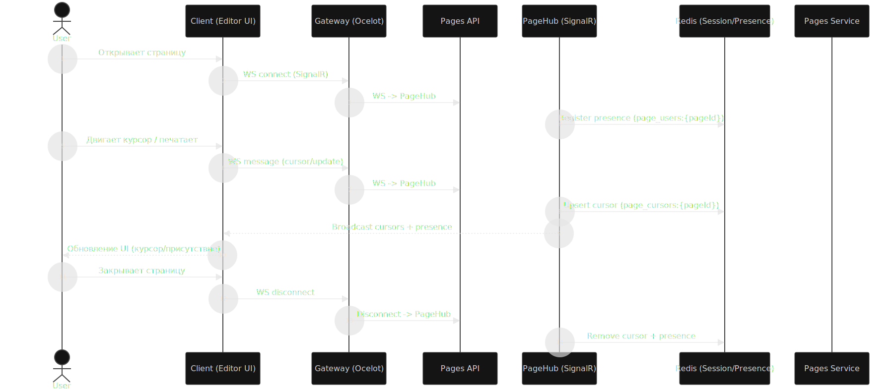
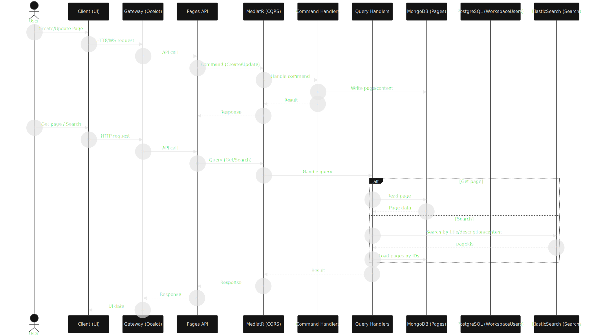
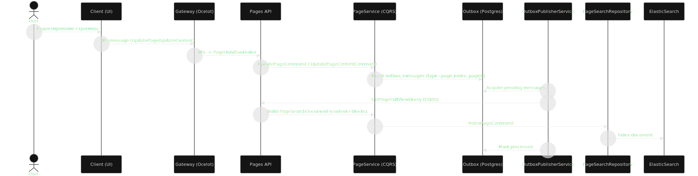
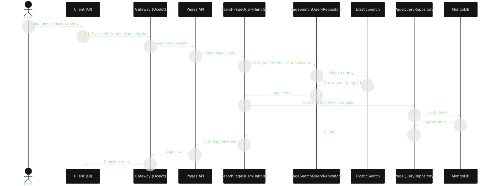
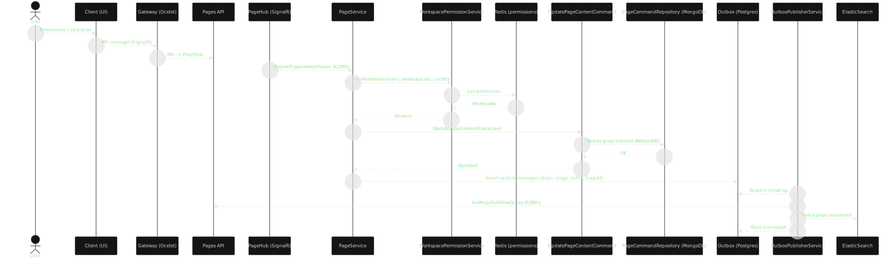

# Luna

Notion‑like платформа для рабочих пространств: страницы, блоки, права, поиск и realtime‑редактирование.
Проект строится на микросервисах, CQRS, event‑driven коммуникации и нескольких хранилищах под разные задачи.

## Оглавление
- [Кратко о проекте](#кратко-о-проекте)
- [Ключевые возможности](#ключевые-возможности)
- [Архитектура и сервисы](#архитектура-и-сервисы)
- [Хранилища по назначению](#хранилища-по-назначению)
- [Основные потоки](#основные-потоки)
- [Технологии](#технологии)
- [Схемы](#схемы)

## Кратко о проекте
Luna — учебно‑портфолио проект с продакшен‑подходом: распределенная архитектура, outbox, CQRS,
асинхронные шины, search и realtime.

## Ключевые возможности
- **Notion‑like страницы**: TipTap‑документ, версии, блоки.
- **CQRS в Pages**: разделение команд и запросов.
- **Event‑driven**: Kafka/RabbitMQ, outbox.
- **Gateway**: Ocelot, единая точка входа.
- **Auth**: JWT + refresh, Google OAuth2.
- **Realtime editing**: SignalR, cursors/presence, Redis.
- **Search**: полнотекстовый поиск через ElasticSearch.

## Архитектура и сервисы
- **Auth** — аутентификация, JWT/refresh, outbox для почтовых кодов.
- **Users** — создание пользователя через gRPC при sign‑in.
- **Workspaces** — права доступа, синхронизация в Pages через Kafka.
- **Pages** — CRUD страниц, версии, поиск, realtime.
- **Notification** — отправка писем по RabbitMQ.

## Хранилища по назначению
- **MongoDB** — страницы и TipTap‑документы (гибкая JSON‑структура).
- **PostgreSQL** — права доступа, связи и транзакционные данные.
- **Redis** — кэш прав, сессии и refresh‑токены.
- **ElasticSearch** — быстрый поиск по контенту страниц.

## Основные потоки
- **Обновление страницы**: WS → Gateway → Pages (CQRS) → Outbox → ES.
- **Поиск**: ES → Mongo (получение результатов).
- **Права**: Workspaces → Kafka → Pages → кэш/БД.
- **Отправка кода**: Auth → Outbox → RabbitMQ → Notification → Email.

## Технологии
- **Backend**: .NET 9, gRPC, EF Core, ADO.NET
- **Frontend**: Next.js, TypeScript
- **Infra**: Ocelot, Kafka, RabbitMQ
- **Storage**: MongoDB, PostgreSQL, Redis, ElasticSearch
- **Realtime**: SignalR

## Схемы
Ключевые потоки и интеграции — от авторизации до индексации и realtime.

### Auth + Refresh Flow
JWT/refresh, Redis и Google OAuth2.

### Код авторизации и уведомления
Outbox → RabbitMQ → Notification → Email.

### Gateway валидирует токены
Ocelot ходит в Auth и прокидывает custom headers.

### Permissions sync
Workspaces → Kafka → Pages → кэш и БД.

### Realtime editing
SignalR cursors + presence + Redis.

### CQRS в Pages
Разделение команд/запросов + поиск.

### Индексация страниц
Outbox → ES: актуализация контента.

### Поиск по контенту
ES → Mongo: получение результатов.

### Обновление страницы по WS
Gateway → SignalR → CQRS → Outbox.

